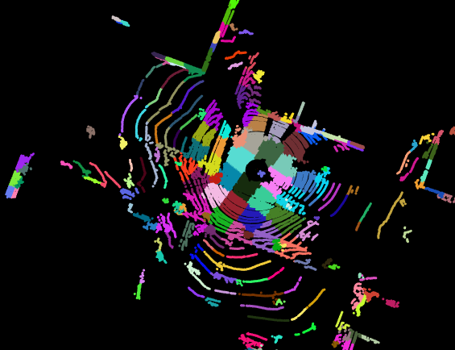
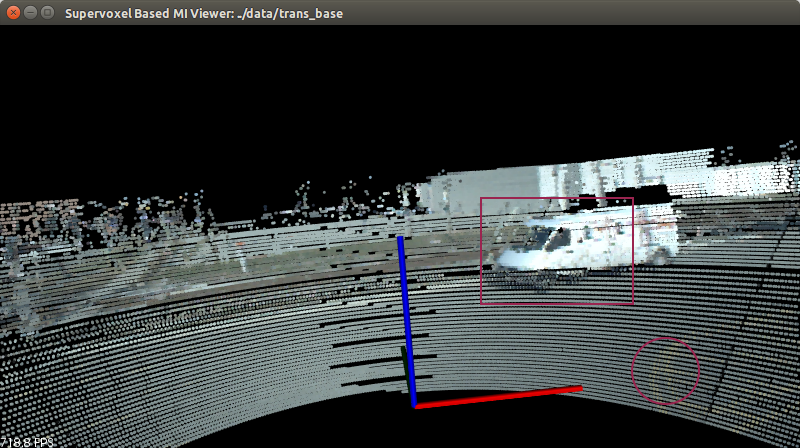
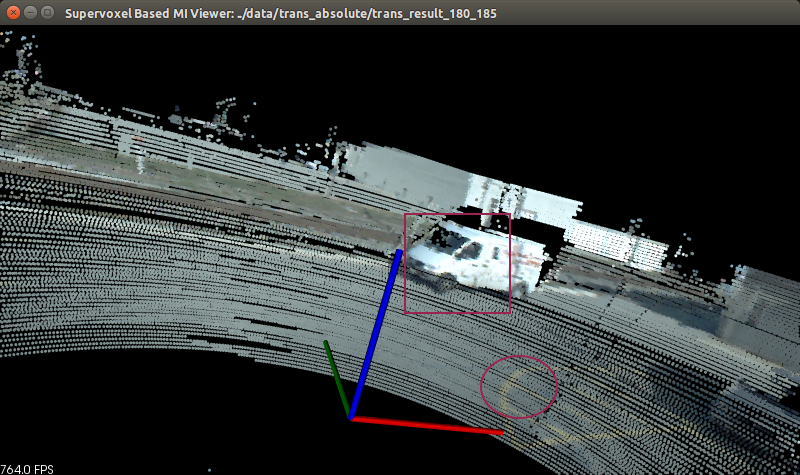

#Clustering based Scan-Registration for fused sensor data

  Problem Statement
  The goal of 3-D scan registration is to estimate the optimal transformation between two scans.  Let two scans  A = {a1,.......,an}and B = {b1,....bm}represent two point clouds recorded by a sensor (eg.- Velodyne Lidar HDL-64E), and the set of 3-D rigid body transformations by SE(3) . In this implementation transformation T  represented by SE(3) is defined by parameter pose represented as [tx, ty, tz, roll, pitch, yaw].  A scan point x transformed by T can be represented as T(p, x) given by:
  T(p, x) = R(yaw)R(pitch)R(roll) x + t
  Where R(theta) is 3x3 Rotation matrix along an axis (x, y, z) by an angle theta (roll, pitch, yaw), and tis 3x1 translation vector.
  Aim of the scan registration algorithm is to find the correct transformation that aligns the two given scans. 

  

  This algo aligns the two scans using Normal distribution Transform on this clustered set.

  
Raw scans from Velodyne HDL-64E

Aligned scans

A GPU implementation will be uploaded soon!

